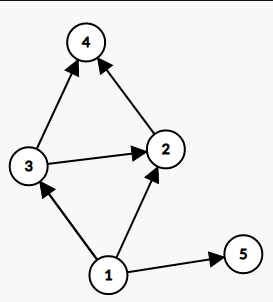
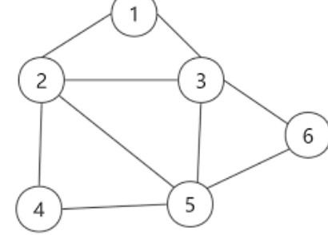
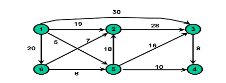
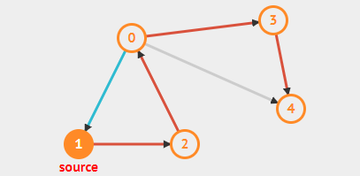
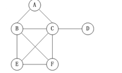

## 结合下列图表，识别所有从1到4的简单路径

## 小明是一名邮递员，每天他都需要到7户人家送信，如下图所示，他想在附近的每一条路上路过一次，而且之路过一次，确定他的路线是否可行，如果可行，请按正确的顺序列出节点，否则，说"Failed"

## 求下图从1出发到其余各点的最短路径

## 写出下图深度优先搜索顺序，从节点1开始

## 结合下列图表，识别所有从A到F的简单路径

