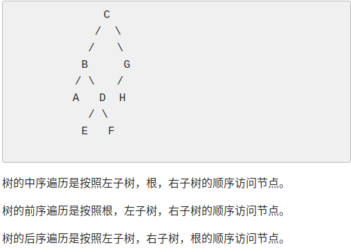

# P1827 美国血统 American Heritage

```c++
#include <bits/stdc++.h>
using namespace std;
string s1,s2;
void build(int l1,int r1,int l2,int r2){
    if(l1>r1||l2>r2)
        return ;
    for(int i=l1;i<=r1;i++){
        if(s1[i]==s2[l2]){
            build(l1,i-1,l2+1,l2+i-l1);
            build(i+1,r1,l2+i-l1+1,r2);
            cout<<s1[i];
        }
    }
}
int main(){
    cin>>s1>>s2;
    build(0,s1.size()-1,0,s2.size()-1);
}
```

树的中序遍历是按照左子树，根，右子树的顺序访问节点。

树的前序遍历是按照根，左子树，右子树的顺序访问节点。

树的后序遍历是按照左子树，右子树，根的顺序访问节点。

 

# P1364 医院设置

```c++
#include <bits/stdc++.h>
using namespace std;
const int maxn=110;
int n,ans=0x3f3f3f3f,vis[maxn];
struct node{
    int left,right,father,value;
}t[maxn];
int cal(int x,int d){
    if(vis[x]||x==0)
        return 0;
    vis[x]=1;
    return cal(t[x].left,d+1)+cal(t[x].right,d+1)+cal(t[x].father,d+1)+t[x].value*d;
}
int main(){
    cin>>n;
    for(int i=1;i<=n;i++){
        cin>>t[i].value>>t[i].left>>t[i].right;
    }
    for(int i=1;i<=n;i++){
        t[t[i].left].father=i;
        t[t[i].right].father=i;
    }
    for(int i=1;i<=n;i++){
        memset(vis,0,sizeof(vis));
        ans=min(ans,cal(i,0));
    }
    cout<<ans;
}
```

```c++
#include <bits/stdc++.h>
using namespace std;
const int maxn=110;
int n,l,r,ans=0x3f3f3f3f,a[maxn],g[maxn][maxn];
int main(){
    cin>>n;
    memset(g,0x3f3f3f3f,sizeof(g));
    for(int i=1;i<n;i++)
        g[i][i]=0;
    for(int i=1;i<=n;i++){
        cin>>a[i]>>l>>r;
        if(l>0)
            g[i][l]=g[l][i]=1;
        if(r>0)
            g[i][r]=g[r][i]=1;
    }
    for(int k=1;k<=n;k++){
        for(int i=1;i<=n;i++){
            for(int j=1;j<=n;j++){
                if(g[i][k]+g[k][j]<g[i][j])
                    g[i][j]=g[i][k]+g[k][j];
            }
        }
    }
    /* for(int i=1;i<=n;i++){ */
    /*     for(int j=1;j<=n;j++){ */
    /*         cout<<g[i][j]<<" "; */
    /*     } */
    /*     cout<<endl; */
    /* } */
    for(int i=1;i<=n;i++){
        int sum=0;
        for(int j=1;j<=n;j++){
            sum+=g[i][j]*a[j];
        }
        if(sum<ans)
            ans=sum;
    }
    cout<<ans;
}
```

# 中序遍历,前序，后序，高度，节点个数

```c++
#include <bits/stdc++.h>
using namespace std;
const int maxn=110;
int n,ans=0x3f3f3f3f,vis[maxn];
struct node{
    int left,right,father,value;
}t[maxn];
void inOrder(int x){//中序 LVR
    if(x!=0){
        inOrder(t[x].left);
        cout<<x;
        inOrder(t[x].right);
    }
}
void PreOrder(int x){//前序 VLR
    if(x!=0){
        cout<<x;
        PreOrder(t[x].left);
        PreOrder(t[x].right);
    }
}
void PostOrder(int x){//后序 LRV
    if(x!=0){
        PostOrder(t[x].left);
        PostOrder(t[x].right);
        cout<<x;
    }
}
int depth(int x){//高度
    if(x==0)
        return 0;
    else 
        return 1+max(depth(t[x].left),depth(t[x].right));
}
int Size(int x){//节点个数
    if(x==0)
        return 0;
    else
        return 1+Size(t[x].left)+Size(t[x].right);
}
int main(){
    cin>>n;
    for(int i=1;i<=n;i++){
        cin>>t[i].value>>t[i].left>>t[i].right;
    }
    for(int i=1;i<=n;i++){
        t[t[i].left].father=i;
        t[t[i].right].father=i;
    }
    inOrder(1);
    cout<<endl;
    PreOrder(1);
    cout<<endl;
    PostOrder(1);
    cout<<endl;
    cout<<depth(1)<<endl;
    cout<<Size(1)<<endl;
}
```

# P1229 遍历问题 

```c++
#include <bits/stdc++.h>
using namespace std;
const int maxn=100010;
int ans;
int main(){
    string a,b;
    cin>>a>>b;
    for(int i=0;i<a.size();i++){
        for(int j=1;j<b.size();j++){
            if(a[i]==b[j]&&a[i+1]==b[j-1])
                ans++;
        }
    }
		cout<<(1<<ans);
}
```

