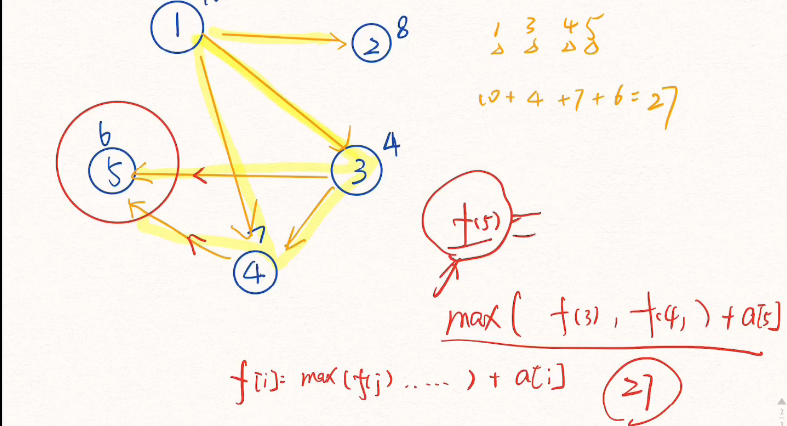

# freopen
```c++
#include <bits/stdc++.h>
using namespace std;
int main(){
    int a,b;
    freopen("test.in","r",stdin);
    freopen("test.out","a",stdout);
    cin>>a>>b;
    cout<<a<<" "<<b<<endl;
}

```

# P1143
```c++
#include <bits/stdc++.h>
using namespace std;
string s;
int n,k;
int sum=0;
stack<char> st;
void n_10(){
    for(int i=0;i<s.size();i++){
        int e=pow(n,s.size()-i-1);
        if(s[i]<'A'){
            e*=(s[i]-'0');
            sum+=e;
        }
        else{
            e*=(s[i]-'A'+10);
            sum+=e;
        }
    }
}
void ten_k(){
    while(sum){
        int temp=sum%k;
        char t;
        if(temp<10)
            t='0'+temp;
        else
            t='A'+(temp-10);
        st.push(t);
        sum/=k;
    }
    while(!st.empty()){
        cout<<st.top();
        st.pop();
    }
}
int main(){
    cin>>n>>s>>k;
    n_10();
    /* cout<<sum<<endl; */
    ten_k();
}

```

# P1100 高地位转换
```c++
#include <bits/stdc++.h>
using namespace std;
int main(){
    int x;
    cin>>x;
    cout<<((x&0x0000ffff)<<16|(x&0xffff0000)>>16)<<endl;
}

```

# P1029 最大公约数和最小公倍数问题 
```c++
#include<bits/stdc++.h>
using namespace std;
int m,n,ans;
int gcd(int a,int b){
    if(a%b==0) return b;
    else return gcd(b,a%b);
}
int main(){
    cin>>m>>n;
    if(m==n)ans--;
    n*=m;
    for(int i=1;i<=sqrt(n);i++)
    {
        if(n%i==0&&gcd(i,n/i)==m) ans+=2;
    }
    cout<<ans;
    return 0;
    }
```
# P1866 编号
```c++
#include <bits/stdc++.h>
using namespace std;
int main(){
    int n,a[100];
    long long ans=1;
    cin>>n;
    for(int i=1;i<=n;i++){
        cin>>a[i];
    }
    sort(a+1,a+n+1);
    for(int i=1;i<=n;i++){
        ans*=a[i]-i+1;
        ans%=1000000007;
    }
    cout<<ans;
}

```
# P5520 [yLOI2019] 青原樱
```c++
#include <bits/stdc++.h>
using namespace std;
long long n,m,mod,res=1;
int main(){
    int a;
    cin>>a;
    cin>>n>>m>>mod;
    for(int i=n-2*m+2;i<=n-m+1;i++)
        res=res*i%mod;
    cout<<res;
}
```
# P1044 栈
```c++
#include <bits/stdc++.h>
using namespace std;
int main(){
    long long a[20]={1};
    int n;
    cin>>n;
    for(int i=1;i<=n;i++){
        for(int j=0;j<i;j++){
            a[i]+=a[j]*a[i-1-j];
        }
    }
    cout<<a[n];
}

```
# P1744 矩阵II
```c++
#include <bits/stdc++.h>
using namespace std;
int n;
int main(){
    int a[1000]={1};
    cin>>n;
    for(int i=1;i<=n;i++){
        for(int j=0;j<i;j++){
            a[i]+=a[j]*a[i-1-j];
            a[i]%=100;
        }
    }
    cout<<a[n]%100;
}

```
# P1976 鸡蛋饼
```c++
#include <bits/stdc++.h>
using namespace std;
int n;
const long long mod = 100000007;
long long a[3333];//用int会有错误
int main(){
    cin>>n;
    a[0]=1;
    for(int i=1;i<=n;i++){
        for(int j=0;j<i;j++){
            a[i]+=a[j]*a[i-1-j];
            a[i]%=mod;
        }
    }
    cout<<a[n]%mod;
}


```

# P3390 【模板】矩阵快速幂
```c++
#include <bits/stdc++.h>
using namespace std;
typedef long long LL;
const LL m=1e9+7;
LL n,k;
struct matrix{
    LL data[105][105];
};
matrix mul(matrix a,matrix b){
    matrix c;
    memset(c.data,0,sizeof(c.data));
    for(int i=1;i<=n;i++){
        for(int j=1;j<=n;j++){
            for(int k=1;k<=n;k++){
                c.data[i][j]=(c.data[i][j]+a.data[i][k]*b.data[k][j]%m)%m;
            }
        }
    }
    return c;
}
matrix quickpow(matrix a,LL k){
    matrix c;
    memset(c.data,0,sizeof(c.data));
    for(int i=1;i<=n;i++)
        c.data[i][i]=1;
    while(k){
        if(k&1)
            c=mul(c,a);
        k>>=1;
        a=mul(a,a);
    }
    return c;
}

int main(){
    scanf("%lld%lld", &n,&k);
    matrix a;
    for(int i=1;i<=n;i++)
        for(int j=1;j<=n;j++)
            scanf("%lld",&a.data[i][j]);
    matrix ans=quickpow(a,k);
    for(int i=1;i<=n;i++){
        for(int j=1;j<=n;j++){
            cout<<ans.data[i][j]<<" ";
        }cout<<endl;
    }

}
```

# P1963 #
```c++
#include <bits/stdc++.h>
using namespace std;
typedef long long LL;
const LL m=1e9+7;
LL n=2,k;
struct matrix{
    LL data[105][105];
};
matrix mul(matrix a,matrix b){
    matrix c;
    memset(c.data,0,sizeof(c.data));
    for(int i=1;i<=n;i++){
        for(int j=1;j<=n;j++){
            for(int k=1;k<=n;k++){
                c.data[i][j]=(c.data[i][j]+a.data[i][k]*b.data[k][j]%m)%m;
            }
        }
    }
    return c;
}
matrix quickpow(matrix a,LL k){
    matrix c;
    memset(c.data,0,sizeof(c.data));
    for(int i=1;i<=n;i++)
        c.data[i][i]=1;
    while(k){
        if(k&1)
            c=mul(c,a);
        k>>=1;
        a=mul(a,a);
    }
    return c;
}

int main(){
    scanf("%lld",&k);
    if(k<=2){
        cout<<1<<endl;
        return 0;
    }
    matrix a;
    a.data[1][1]=a.data[1][2]=a.data[2][1]=1;
    a.data[2][2]=0;
    matrix f;
    f.data[1][1]=f.data[2][1]=f.data[1][2]=f.data[2][2]=1;
    matrix ans=quickpow(a,k-2);
    ans=mul(ans,f);
    cout<<ans.data[1][1]<<endl;

}
```
# P2196 挖地雷 #

```c++
#include <bits/stdc++.h>
using namespace std;
int n,a[30],p[30],g[30][30],f[30];
int maxx,maxi;
void dg(int x){
    if(x==0)
        return ;
    dg(p[x]);
    cout<<x<<" ";
}
int main(){
    cin>>n;
    for(int i=1;i<=n;i++){
        cin>>a[i];
        f[i]=a[i];
    }
    for(int i=1;i<n;i++){
        for(int j=i+1;j<=n;j++){
            cin>>g[i][j];
        }
    }
    for(int i=1;i<=n;i++){
        for(int j=1;j<i;j++){
            if(g[j][i]==1){
                if(f[i]<f[j]+a[i]){
                    p[i]=j;
                    f[i]=f[j]+a[i];
                }
            }
        }
        if(maxx<f[i]){
            maxx=f[i];
            maxi=i;
        }
    }
    dg(maxi);
    cout<<endl<<maxx<<endl;
}

```

