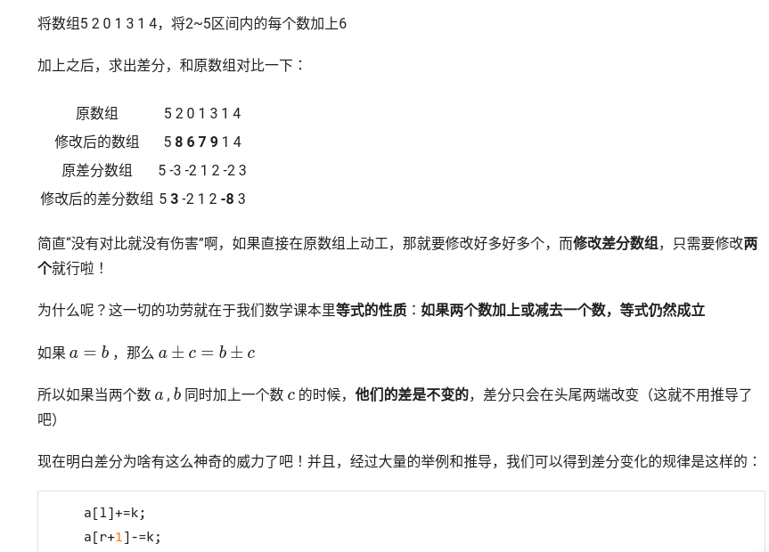
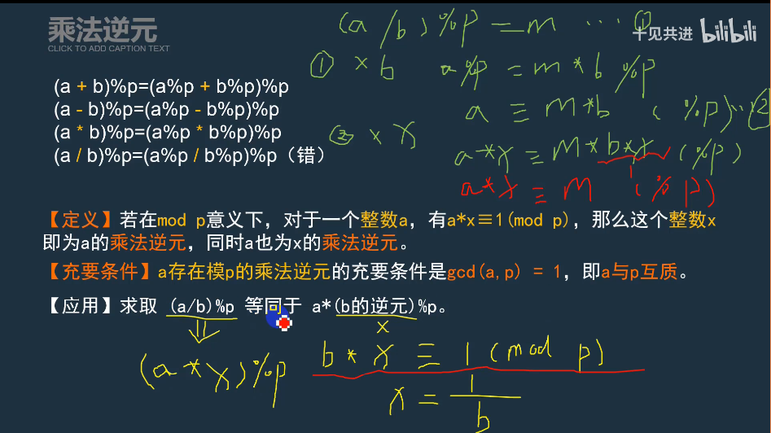
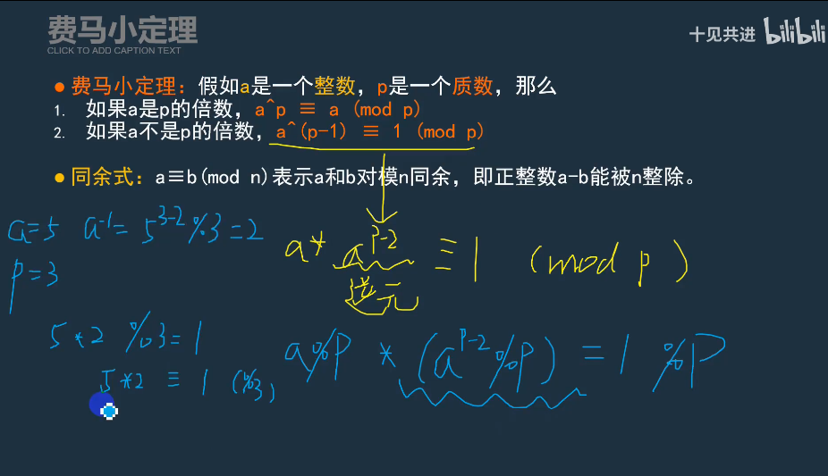
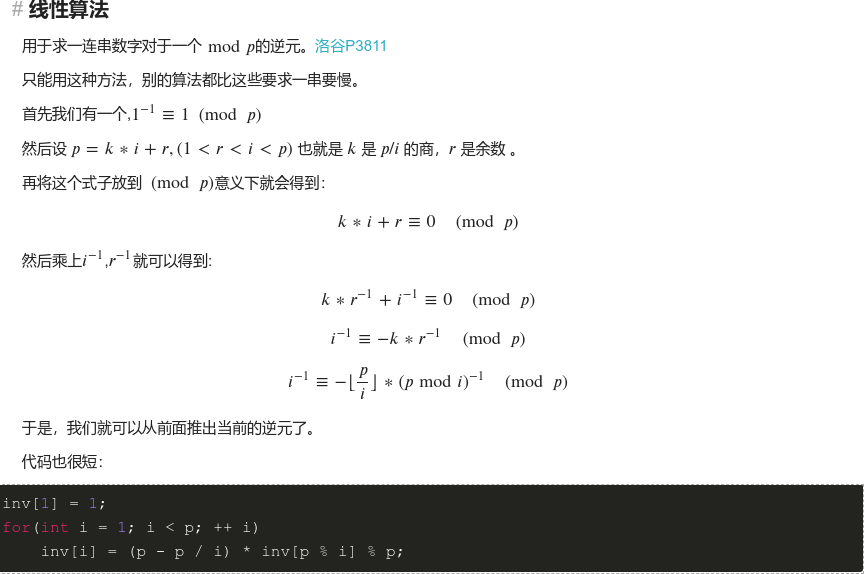
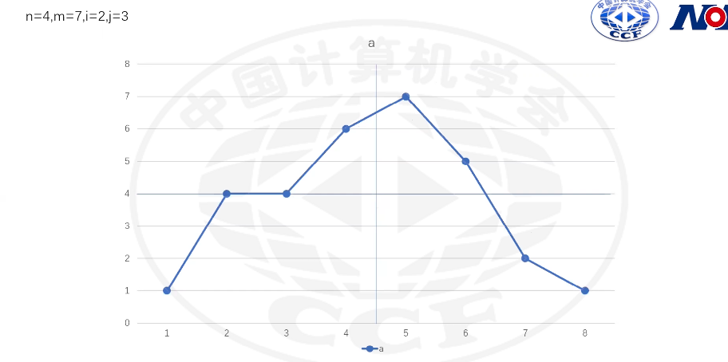
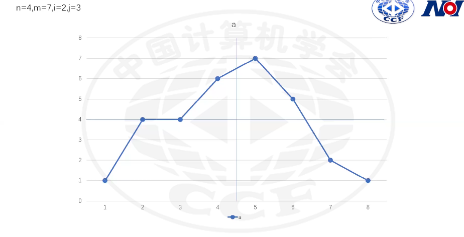
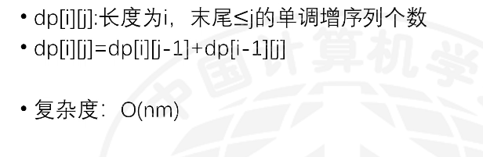
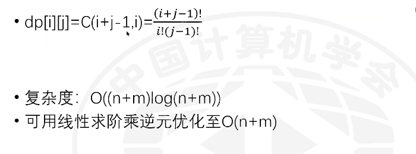

# 第2轮 NOI Online入门组

## 第一题：未了(endless)

### 知识点

lower_bound 和upper_bound需要用在一个有序数组和容器中。

- lower_bound (first,last,val)用来寻找在数组和容器[first,last)的范围内，第一个值**大于等于**val的元素的位置。如果是数组，则返回该位置的指针，如果是容器，则返回该位置的迭代器。
- upper_bound(first,last,val)用来寻找在数组和容器[first,last)的范围内，第一个值**大于**val的元素的位置。如果是数组，则返回该位置的指针，如果是容器，则返回该位置的迭代器。

- 演示代码

```c++
#include<iostream>
#include<algorithm>
using namespace std;
int main(){
	int a[10]={1,2,2,3,3,3,5,5,5,5};
	//寻找3
	cout<<lower_bound(a,a+10,3)-a<<","<<upper_bound(a,a+10,3)-a<<endl;
	return 0;
} 
```


### code

```c++
#include <bits/stdc++.h>
using namespace std;
/*
s=vt,二分   upper_bound,lower_bound
n=1    只有一种魔法
魔法相当于增加了路程
long long is needed
*/
long long n,L,v,q;
long long sum[200005],a[200005];
int main(){
    cin>>n>>L>>v;
    sum[0]=L;
    for(long long i=0;i<n;i++){
        scanf("%d",&a[i]);
    }
    sort(a,a+n);
    reverse(a,a+n);
    for(long long i=0;i<n;i++){
        sum[i+1]=sum[i]+a[i];
    }
    cin>>q;
    for(long long i=0;i<q;i++){
        long long t;
        cin>>t;
        long long s=1ll*t*v;
        long long ans=upper_bound(sum,sum+n+1,s)-sum;
        if(ans==n+1)
            cout<<-1<<endl;
        else
            cout<<ans<<endl;
    }
}
```

## 荆轲刺秦王 

### 知识点

- 差分
    - 数组元素中，每两项之间的差（特别的，差分数组的第一项原数组的第一项自己)

        > 原数组：  5 2 0 1 3 1 4

        >每两项的差： 2-5=-3  0-2=-2  1-0=1  3-1=2  1-3=-2  4-1=3 

        >差分数组：5 -3 -2 1 2 -2 3

    - 
    - 
    - 差分的前缀和就是它本身


[reference](https://www.luogu.com.cn/blog/ravenclawyangrunze/solution-at2442)

### code

```c++
#include<iostream>
#include<cstdio>
#include<queue>
using namespace std;
struct node{//node结构体
    int x,y,yx,sy,s;
};
node minq(node a,node b){//找最优解
    if(a.s!=b.s)return a.s<b.s?a:b;
    if(a.yx+a.sy!=b.yx+b.sy)return a.yx+a.sy<b.yx+b.sy?a:b;
    return a.yx<b.yx?a:b;
}
bool vis[355][355][20][20],look[355][355];//一堆杂七杂八的东西
int tag[355][355];
int n,m,c1,c2,d;
int map[355][355];
const int dx[8]={1,0,-1,0,1,-1,-1,1},dy[8]={0,1,0,-1,1,1,-1,-1};
void lookaround(int x,int y,int k){//处理看到的范围（差分数组tag）
    for(int i=0;i<=k;i++){
        tag[max(x-i,1)][max(y-(k-i),1)]++; 
        tag[max(x-i,1)][min(y+(k-i),m)+1]--;
        tag[min(x+i,n)][max(y-(k-i),1)]++;
        tag[min(x+i,n)][min(y+(k-i),m)+1]--;
    }
}
int sx,sy,ex,ey;
queue <node> q;//队列
node ans=(node){0,0,233333333,233333333,233333333};
void bfs(){//广搜
    while(!q.empty()){
        node fro=q.front();
        q.pop();
        if(fro.s>ans.s)continue;//最优性剪纸
        if(fro.x==ex&&fro.y==ey){//找到最优解后
            ans=minq(ans,fro);
            continue;
        } 
        for(int i=0;i<8;i++){//不瞬移,8个方向
            int nx=fro.x+dx[i];
            int ny=fro.y+dy[i];
            if(nx<1||nx>n||ny<1||ny>m||map[nx][ny]>0)continue;
            if(look[nx][ny]){
                //隐身
                if(vis[nx][ny][fro.yx+1][fro.sy]||fro.yx+1>c1)continue;
                vis[nx][ny][fro.yx+1][fro.sy]=1;
                q.push((node){nx,ny,fro.yx+1,fro.sy,fro.s+1});
            }
            else{
                if(vis[nx][ny][fro.yx][fro.sy])continue;
                vis[nx][ny][fro.yx][fro.sy]=1;
                q.push((node){nx,ny,fro.yx,fro.sy,fro.s+1});             
            }
        }
        if(fro.sy+1>c2)continue;
        for(int i=0;i<4;i++){//4个方向瞬移
            int nx=fro.x+dx[i]*d;
            int ny=fro.y+dy[i]*d;
            if(nx<1||nx>n||ny<1||ny>m||map[nx][ny]>0)continue;
            if(look[nx][ny]){
                if(vis[nx][ny][fro.yx+1][fro.sy+1]||fro.yx+1>c1)continue;
                vis[nx][ny][fro.yx+1][fro.sy+1]=1;
                q.push((node){nx,ny,fro.yx+1,fro.sy+1,fro.s+1});
            }
            else{
                if(vis[nx][ny][fro.yx][fro.sy+1])continue;
                vis[nx][ny][fro.yx][fro.sy+1]=1;
                q.push((node){nx,ny,fro.yx,fro.sy+1,fro.s+1});               
            }           
        }
    }
}
int main(){
    cin>>n>>m>>c1>>c2>>d;
    for(int i=1;i<=n;i++){
        for(int j=1;j<=m;j++){
            string s;
            cin>>s;
            if(s[0]=='S'){
                sx=i,sy=j;
                map[i][j]=-1;
                q.push((node){sx,sy,0,0,0});
                vis[i][j][0][0]=1;
            }
            else if(s[0]=='T'){
                ex=i,ey=j;
                map[i][j]=-2;
            }
            else if(s[0]=='.')map[i][j]=0;
            else{
                int x=0;
                for(int i=0;i<s.size();i++)
                    x=x*10+s[i]-'0';
                map[i][j]=x;
                lookaround(i,j,x-1);
            }
        }
    }
    for(int i=1;i<=n;i++){
        int sum=0;
        for(int j=1;j<=m;j++){
            sum+=tag[i][j]; //求出look数组（前缀和）
            if(sum>0)look[i][j]=1;  
        }
    }   
    bfs();//广搜
    if(ans.s==233333333)printf("-1");
    else printf("%d %d %d",ans.s,ans.yx,ans.sy);//最后输出
    return 0;
}
```


## 建设城市

### 知识点

P3811 [模板] 乘法逆元

[参考博客](https://www.cnblogs.com/zjp-shadow/p/7773566.html)





```c++
#include <bits/stdc++.h>
using namespace std;
//时间复杂度过不了
long long fpm(long long x, long long power, long long mod) {
    x %= mod;
    long long ans = 1;
    for (; power; power >>= 1, (x *= x) %= mod)
    	if(power & 1) (ans *= x) %= mod;
    return ans;
}
int main() {
    int a,p;
    cin>>a>>p;
    for(int i=1;i<=a;i++){
        cout<<fpm(i,p-2,p)<<endl;
    }
}
```



```c++
#include<cstdio>
using namespace std;
long long n,p;
long long ans[5000010]={0,1};
int main()
{
scanf("%lld%lld",&n,&p);
printf("1\n");
for(long long i=2;i<=n;i++) //线性递推
  {
    ans[i]=(long long)(p-p/i)*ans[p%i]%p;
    printf("%lld\n",ans[i]); 
  }
}
```

动态规划:

- case1,x<y<=n:
>



- case2,x<=n<y:
>



- 状态转移方程



- 排列组合



插板法:

- 每个元素必须相同
- 分成的组,每组元素不为空
- 10个相同的球放入3个不同的盒子,每个盒子至少一个,将9个板插入十个球,选择两个板子

### code

```c++
#include<bits/stdc++.h>
#define ll long long
#define mod 998244353
using namespace std;
int n,m,x,y;
int t;
int f[5005][5005];
int main(){
	scanf("%d%d%d%d",&m,&n,&x,&y);
	for(int i=1;i<=n+2;i++){
		f[i][1]=1;
		for(int j=2;j<=m+1;j++){
			f[i][j]=(f[i-1][j]+f[i][j-1])%mod;
		}
	}
	if(x<=n&&y>n){
		int ans=0;
		for(int i=1;i<=m;i++){
			ans=(ans+((ll)f[x][i]*f[n-x+1][m-i+1]%mod*f[y-n][m-i+1]%mod*f[n*2-y+1][i]%mod))%mod;
		}
		printf("%d",ans);
	}
	else{
		printf("%d",(ll)f[n+1][m]*f[x+n-y+1][m]%mod);
	}
	return 0;
}
```

```c++
#include<bits/stdc++.h>
#define f(x,y) ((long long)k[x+y-1]*invk[y-1]%mod*invk[x]%mod)
#define ll long long
#define mod 998244353
using namespace std;
int n,m,x,y;
int k[200001];
int inv[200001];
int invk[200001];
int main(){
	scanf("%d%d%d%d",&m,&n,&x,&y);
	register int i,ans=0;
	k[0]=inv[1]=invk[0]=1;
	for(i=2;i<=n+m;i++)inv[i]=((ll)mod-mod/i)*inv[mod%i]%mod;//处理1到n的逆元
	for(i=1;i<=n+m;i++)k[i]=(ll)k[i-1]*i%mod;//处理阶乘
	for(i=1;i<=n+m;i++)invk[i]=(ll)invk[i-1]*inv[i]%mod;//处理阶乘数组的逆元
	if(x<=n&&y>n){
		for(i=1;i<=m;i++)ans=(ans+((ll)f(x-1,i)*f(n-x,m-i+1)%mod*f(y-n-1,m-i+1)%mod*f(n*2-y,i)%mod))%mod;
		printf("%d",ans);
	}
	else{
		printf("%d",(ll)f(n,m)*f(x+n-y,m)%mod);
	}
	return 0;
}
```


# 另一套

## 跑步

```c++
#include <bits/stdc++.h>
using namespace std;
int dp[100001+5];
int main(){
	int n,p;
	cin>>n>>p;
	dp[0]=1;
	for(int i=1;i<=n;i++){
		for(int j=i;j<=n;j++){
			dp[j]=(dp[j-i]+dp[j])%p;
		}
	}
	cout<<dp[n];
} 
/*
  0 1 2 3 4 5(sum) 
0 1 0 0 0 0 0 
1 1 1 1 1 1 1(可利用的数有{0，1}) 
2
3
4
5
(可利用的数)
考虑现在的新数和不考虑 
https://zhuanlan.zhihu.com/p/111760454
https://studyingfather.blog.luogu.org/pentagonal-number-and-number-partitions
*/
```


```c++
#include <bits/stdc++.h>
using namespace std;
#define MAXN 100005
int n,p,ans;
int f[MAXN],g[MAXN][330];
int main(){
    cin>>n>>p;
    f[0]=1;
    int m=sqrt(n)+1;
    for(int i=1;i<=m;i++){
        for(int j=i;j<=n;j++){
            f[j]=(f[j-i]+f[j])%p;
        }
    }
    m++;
    g[0][0]=1;
    for(int i=m;i<=n;i++){
        g[i][1]=1;
        for(int j=2;j<=m;j++){
            g[i][j]=(g[i-j][j]+g[i-m][j-1])%p;
        }
    }
    for(int i=0;i<=n;i++){
        for(int j=0;j<=m;j++){
            ans=(ans+1ll*f[i]*g[n-i][j])%p;
        }
    }
    cout<<ans<<endl;
}
```


## 魔法

### 知识点

- 动态规划

- 矩阵乘法


### code

```c++
#include <cstring>
#include <iostream>
#include <algorithm>
using namespace std;
struct edge
{
 int u,v,w;
}e[2505];
int n,m,k;
struct mat
{
 long long a[105][105];
 mat(int x=63)
 {
  memset(a,x,sizeof(a));
 }
 mat operator*(const mat&b)const
 {
  mat ans;
  for(int k=1;k<=n;k++)
   for(int i=1;i<=n;i++)
    for(int j=1;j<=n;j++)
     ans.a[i][j]=min(ans.a[i][j],a[i][k]+b.a[k][j]);
  return ans;
 }
}a;
long long f[105][105];
mat fpow(mat x,int y)
{
 mat ans;
 for(int i=1;i<=n;i++)
  for(int j=1;j<=n;j++)
   ans.a[i][j]=f[i][j];
 while(y)
 {
  if(y&1)ans=ans*x;
  x=x*x;
  y>>=1;
 }
 return ans;
}
int main()
{
 memset(f,63,sizeof(f));
 cin>>n>>m>>k;
 for(int i=1;i<=n;i++)
  f[i][i]=0;
 for(int i=1;i<=m;i++)
 {
  cin>>e[i].u>>e[i].v>>e[i].w;
  f[e[i].u][e[i].v]=e[i].w;
 }
 for(int k=1;k<=n;k++)
  for(int i=1;i<=n;i++)
   for(int j=1;j<=n;j++)
    f[i][j]=min(f[i][j],f[i][k]+f[k][j]);
 for(int k=1;k<=m;k++)
 {
  int u=e[k].u,v=e[k].v,w=e[k].w;
  for(int i=1;i<=n;i++)
   for(int j=1;j<=n;j++)
    a.a[i][j]=min(a.a[i][j],min(f[i][j],f[i][u]+f[v][j]-w));
 }
 if(k==0)cout<<f[1][n]<<endl;
 else cout<<fpow(a,k).a[1][n]<<endl;
 return 0;
}
```

