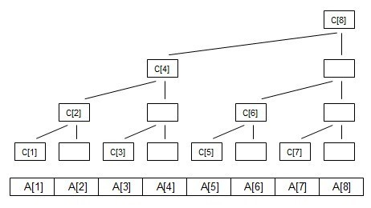
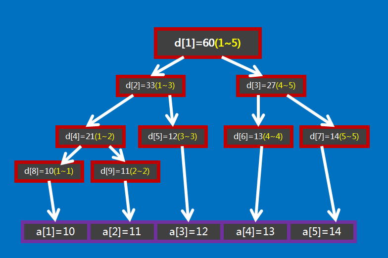

# 树状数组

## 简介

用数组来模拟树形结构，树状数组能处理的问题就没必要建树。

修改和查询的复杂度都是O(logN)，而且相比线段树系数要少很多，比传统数组要快，而且容易写。

缺点是遇到复杂的区间问题还是不能解决，功能还是有限。

## 与线段树的区别

树状数组能有的操作，线段树一定有；

线段树有的操作，树状数组不一定有。

树状数组的代码要比线段树短得多，思维也更清晰，在解决一些单点修改的问题时，树状数组是不二之选。

## 举例



C[i]代表 子树的叶子结点的权值之和// **这里以求和举例**

C[1]=A[1];

C[2]=A[1]+A[2];

C[3]=A[3];

C[4]=A[1]+A[2]+A[3]+A[4];

C[5]=A[5];

C[6]=A[5]+A[6];

C[7]=A[7];

C[8]=A[1]+A[2]+A[3]+A[4]+A[5]+A[6]+A[7]+A[8];


将C数组的结点序号转化为**二进制**

1=(001)    C[1]=A[1];

2=(010)    C[2]=A[1]+A[2];

3=(011)    C[3]=A[3];

4=(100)    C[4]=A[1]+A[2]+A[3]+A[4];

5=(101)    C[5]=A[5];

6=(110)    C[6]=A[5]+A[6];

7=(111)    C[7]=A[7];

8=(1000)   C[8]=A[1]+A[2]+A[3]+A[4]+A[5]+A[6]+A[7]+A[8];

对照式子可以发现  **C[i]=A[i-2^k+1]+A[i-2^k+2]+......A[i]; （k为i的二进制中从最低位到高位连续零的长度）例如i=8时，k=3;**

简单举例就是，对于110（6），只有一个0，所以只需要$2^1$个数，即C[6]=A[5]+A[6]

110	6	我们现在查询a[1]到a[6]的和

110	C[6]

100	C[4]

```c++
int d[100005],n;
int lowbit(int x) {
  return x & -x;
  //1100&0100(12&-12)
}
int query(int x){
    int res=0;
    while(x){
        res+=d[x];
        x-=lowbit(x);
    }
    return res;
}
//修改可以看做查询的逆过程
void add(int x,int v){//对a[x]加v
    while(x<=n){
        d[x]+=v;
        x+=lowbit(x);
    }
}
```

# 线段树

线段树是用来维护 **区间信息** 的数据结构。

线段树可以在 $O(\log N)$ 的时间复杂度内实现单点修改、区间修改、区间查询（区间求和，求区间最大值，求区间最小值）等操作。

有个大小为 $5$ 的数组 $a={10,11,12,13,14}$ ，要将其转化为线段树，有以下做法：设线段树的根节点编号为 $1$ ，用数组 $d$ 来保存我们的线段树， $d[i]$ 用来保存线段树上编号为 $i$ 的节点的值（这里每个节点所维护的值就是这个节点所表示的区间总和），如图所示：



上面这棵树类似满二叉树，所以可以直接用数组来存。

# set、map、priority_queue

## set

- set中的元素都是排好序的
- set集合中没有重复的元素

```c++
#include <iostream>
#include <set>
using namespace std;
int main(){
     set<int> s;
     s.insert(1);
     s.insert(2);
     s.insert(3);
     s.insert(1);
     cout<<"set 的 size 值为 ："<<s.size()<<endl;
     cout<<"set 的 maxsize的值为 ："<<s.max_size()<<endl;
     cout<<"set 中的第一个元素是 ："<<*s.begin()<<endl;
     cout<<"set 中的最后一个元素是:"<<*s.end()<<endl;
     s.clear();
     if(s.empty()){
         cout<<"set 为空 ！！！"<<endl;
     }
     cout<<"set 的 size 值为 ："<<s.size()<<endl;
     cout<<"set 的 maxsize的值为 ："<<s.max_size()<<endl;
     set<int>::iterator it;              
     for(it=s.begin();it!=s.end();it++)  //使用迭代器进行遍历    
        printf("%d\n",*it);  
     return 0;
}
```

**begin() 返回set容器第一个元素的迭代器**

**end() 返回一个指向当前set末尾元素的下一位置的迭代器.**

**clear()  删除set容器中的所有的元素**

**empty()判断set容器是否为空**

**insert() 向容器中插入一个数**

**size() 返回当前set容器中的元素个数**

**set<int>::iterator it进行遍历**

## map

map的特性是，所有元素都会根据元素的减值自动被排序。map的所有元素都是pair，同时拥有实值(value)和键值(key)。pair的第一个元素会被视为键值，第二个元素会被视为实值。map不允许两个元素拥有相同的键值。

```
map<int,string> m;
m.insert(map<int,string>::value_type(1,"a"));
m[2]="a";
pair<int,string> value(3,"a")；maplive.insert(value);
```

```c++
#include <iostream>
#include "string.h"
#include "stdio.h"
#include<map>
using namespace std;

int main(){
    map<string,int> strMap;  //以string为键值，以int为实值
    strMap[string("jjhou")] = 1;
    strMap[string("jerry")] = 2;
    strMap[string("jason")] = 3;
    strMap[string("jimmy")] = 4;

    pair<string,int> value(string("david"),5);
    strMap.insert(value);//插入新元素

    map<string,int>::iterator strmap_iter = strMap.begin();
    for(;strmap_iter !=strMap.end();strmap_iter++)
    {
        cout<<strmap_iter->first<<' '<<strmap_iter->second<<endl;
    }
    cout<<endl;
}
```

## priority_queue

在优先队列中，元素被赋予优先级。当访问元素时，具有最高优先级的元素最先删除。优先队列具有最高级先出 （first in, largest out）的行为特征。

优先队列具有队列的所有特性，包括队列的基本操作，只是在这基础上添加了内部的一个排序，它本质是一个堆实现的。

```c++
//升序队列
priority_queue <int,vector<int>,greater<int> > q;
//降序队列
priority_queue <int,vector<int>,less<int> >q;

//greater和less是std实现的两个仿函数（就是使一个类的使用看上去像一个函数。其实现就是类中实现一个operator()，这个类就有了类似函数的行为，就是一个仿函数类了）
```

## LCA

最近公共祖先简称 LCA（Lowest Common Ancestor）。两个节点的最近公共祖先，就是这两个点的公共祖先里面，离根最远的那个。

### 性质

- 两点的最近公共祖先必定处在树上两点间的最短路上；
- $d(u,v)=h(u)+h(v)-2h(\text{LCA}(u,v))$ ，其中 $d$ 是树上两点间的距离， $h$ 代表某点到树根的距离。

### 朴素算法

先向上调整深度较大的点，令他们深度相同，然后再共同向上跳转，最后也一定会相遇。

### 倍增算法

倍增可以在logn的时间复杂度完成

任何一个数字都可以用二进制表示

`fa[x][i]` 表示点 $x$ 的第 $2^i$ 个祖先。 `fa[x][i]` 数组可以通过 dfs 预处理出来。

在调整游标的第一阶段中，我们可以计算出 $u,v$ 两点的深度之差，设其为 $y$ 。通过将 $y$ 进行二进制拆分，我们将 $y$ 次游标跳转优化为 `count_one_in_binary_representation(y)` 次游标跳转。 在第二阶段中，我们从最大的 $i$ 开始循环尝试，一直尝试到 $0$ （包括 $0$ ），如果 `fa[u][i] != fa[v][i]` ，则令 `u = fa[u][i]; v = fa[v][i]` ，那么最后的 LCA 为 `fa[u][0]` 。

# 前缀和 & 差分

## 前缀和

可以简单理解为“数列的前 n 项的和”。

```
有 N 个的正整数放到数组 A 里，现在要求一个新的数组 B，新数组的第 i 个数 B[i]是原数组 A 第 0 到第 i 个数的和。
有两种方法：
暴力：把对数组 A 的累加依次放入数组 B 中。
递推： B[i] = B[i-1] + A[i] ，前提 B[0] = A[0] 。
```

### 树上前缀和

设 $sum_i$ 表示结点 $i$ 到根节点的权值总和。
然后若是点权， $x,y$ 路径上的和为 $sum_x + sum_y - sum_{lca} - sum_{fa_{lca}}$ ；
否则若是边权， $x,y$ 路径上的和为 $sum_x + sum_y - 2sum_{lca}$ 。

## 差分

差分，是一种和前缀和相对的策略。
这种策略是，令B[i] = A[i] - A[i-1] ，即相邻两数的差。
易得对这个序列做一遍前缀和就得到了原来的 序列。

它可以维护多次对序列的一个区间加上一个数，并在最后询问某一位的数或是多次询问某一位的数。（总之修改操作一定要在查询操作之前）

譬如使 $[l,r]$ 每个数加上一个 $k$ ，就是 $b_l \leftarrow b_l + k,b_{r + 1} \leftarrow b_{r + 1} - k$ 。

若求某一位B数组的值，最后做一遍前缀和就好了。

### 树上差分

如果使 $x,y$ 路径上的点权增加 $k$ ， $b_x \leftarrow b_x + k,b_y \leftarrow b_y + k,b_{lca} \leftarrow b_{lca} - k,b_{fa_{lca}} \leftarrow b_{fa_{lca}} - k$ ，

如果是边权， $b_x \leftarrow b_x + k,b_y \leftarrow b_y + k,b_{lca} \leftarrow b_{lca} - 2k$ 。

那么我们知道，如果假设我们要考虑的是从u到v的路径，u与v的lca是a。所以，我们可以将路径拆分成两条链，u->a和a->v。那么树上差分有两种常见形式：（1）关于边的差分；（2）关于节点的差分。

### ①关于边的差分：

将边拆成两条链之后，我们便可以像差分一样来找到路径了。用b[i]代表从i到i的父亲这一条路径经过的次数。因为关于边的差分，a是不在其中的，所以考虑链u->a，则就要使b[u]++，b[a]−−。然后链a->v，也是b[v]++，b[a]−−。所以合起来便是b[u]++，b[v]++，b[a]−=2。然后，从根节点，对于每一个节点x，都有如下的步骤：

​		（1）枚举x的所有子节点u

　　（2）dfs所有子节点u

　　（3）b[x]+=b[u]

### ②关于点的差分：

　　还是与和边的差分一样，对于所要求的路径，拆分成两条链。步骤也和上面一样，但是也有一些不同，因为关于点，u与v的lca是需要包括进去的，所以要把lca包括在某一条链中，用b[i]表示i被访问的次数。最后对b数组的操作便是b[u]++，b[v]++，b[a]−−，b[father[a]]−−。

然后一遍搜索求一下子树和答案就出来了。

# 题目

## P3128 [USACO15DEC]最大流Max Flow

假设一条u到v的路径，那么这条路径是$u--->lca(u,v)--->v$的，所以我们把$u--->lca(u,v)$与$lca(u,v)--->v$两条路径各自加一，也就是++power[u],++power[v],power[lca(u,v)]--,power[lca(u,v)的父亲]--

- 邻接矩阵

  ```c++
  struct  Node{
      int to,next;
  };
  Node edge[maxn];
  int head[maxn],num;
  void add(int x,int y){
      edge[++num].to=y;
      edge[num].next=head[x];
      head[x]=num;
  }
  ```

- 初始化
  d[]表示深度，$fa[i][j]$表示i的j次方倍祖先,递归实现

  ```c++
  int power[maxn],d[maxn],fa[maxn][30];
  void work(int u,int fath){
      d[u]=d[fath]+1;
      fa[u][0]= fath;
      for(int i=0;fa[u][i];++i){
          fa[u][i+1]=fa[fa[u][i]][i];
      }
      for(int i=head[u];i;i=edge[i].next){
          int e=edge[i].to;
          if(e!=fath)
              work(e,u);
      }
  }
  ```

- LCA
  首先将u，v调整到相同深度，然后……

  ```c++
  int Lca(int u,int v){
      if(d[u]>d[v])
          swap(u,v);
      for(int i=20;i>=0;--i){
          if(d[u]<=d[v]-(1<<i))
              v=fa[v][i];
      }
      if(u==v)
          return u;
      for(int i=20;i>=0;--i){
          if(fa[u][i]!=fa[v][i])
              u=fa[u][i],v=fa[v][i];
      }
      return fa[u][0];
  }
  ```

- 树上差分
  首先通过LCA找到公共祖先，然后++power[u],++power[v],power[lca(u,v)]--,power[lca(u,v)的父亲]--

  ```c++
  for(int i=1;i<=m;++i){
          cin>>x>>y;
          int lca=Lca(x,y);
          ++power[x];
          ++power[y];
          --power[lca];
          --power[fa[lca][0]];
  }
  ```

- 递归得到最大值

  ```c++
  void Get(int u,int fath){
      for(int i=head[u];i;i=edge[i].next){
          int e=edge[i].to;
          if(e== fath)
              continue;
          Get(e,u);
          power[u]+=power[e];
      }
      ans=max(ans,power[u]);
  }
  ```

- 完整代码

  ```c++
  #include <bits/stdc++.h>
  using namespace std;
  const int maxn=100010
  struct  Node{
      int to,next;
  };
  Node edge[maxn];
  int head[maxn],power[maxn],n,m,d[maxn],fa[maxn][30],ans,num;
  void add(int x,int y){
      edge[++num].to=y;
      edge[num].next=head[x];
      head[x]=num;
  }
  void work(int u,int fath){
      d[u]=d[fath]+1;
      fa[u][0]= fath;
      for(int i=0;fa[u][i];++i){
          fa[u][i+1]=fa[fa[u][i]][i];
      }
      for(int i=head[u];i;i=edge[i].next){
          int e=edge[i].to;
          if(e!=fath)
              work(e,u);
      }
  }
  int Lca(int u,int v){
      if(d[u]>d[v])
          swap(u,v);
      for(int i=20;i>=0;--i){
          if(d[u]<=d[v]-(1<<i))
              v=fa[v][i];
      }
      if(u==v)
          return u;
      for(int i=20;i>=0;--i){
          if(fa[u][i]!=fa[v][i])
              u=fa[u][i],v=fa[v][i];
      }
      return fa[u][0];
  }
  void Get(int u,int fath){
      for(int i=head[u];i;i=edge[i].next){
          int e=edge[i].to;
          if(e== fath)
              continue;
          Get(e,u);
          power[u]+=power[e];
      }
      ans=max(ans,power[u]);
  }
  int main(){
      cin>>n>>m;
      int x,y;
      for(int i=1;i<n;++i){
          cin>>x>>y;
          add(x,y);
          add(y,x);
      }
      work(1,0);
      for(int i=1;i<=m;++i){
          cin>>x>>y;
          int lca=Lca(x,y);
          ++power[x];
          ++power[y];
          --power[lca];
          --power[fa[lca][0]];
      }
      Get(1,0);
      cout<<ans<<endl;
  }
  ```

  ### P2375
  
  ```c++
  #include <bits/stdc++.h>
  #define maxl 1000000+1
  #define mod 1000000007
  using namespace std;
  int f[maxl],t[maxl];
  int n;
  string s;
  int main() {
      scanf("%d",&n);
      while(n--){
          cin>>s;
          f[0]=-1;
          f[1]=0;
          t[0]=0;
          t[1]=1;
          int j=0;
          long long ans=1;
          for(int i=1;i<s.length();i++) {
              while(j>=0&&s[i]!=s[j]) j=f[j];
              f[i+1]=++j;
              t[i+1]=t[j]+1;
          }
          for(int i=0;i<s.length();i++){
              cout<<f[i]<<" ";
          }cout<<endl;
          for(int i=0;i<s.length();i++){
              cout<<t[i]<<" ";
          }cout<<endl;
          j=0;
          for(int i=1;i<s.length();i++) {
              while(j>=0&&s[i]!=s[j])
                  j=f[j];
              j++;
              while((j<<1)>(i+1))
                  j=f[j];
              ans*=(long long)t[j]+1;
              ans%=mod;
          }
          cout<<ans<<endl;
      }
      return 0;
  }
  ```
  
  

