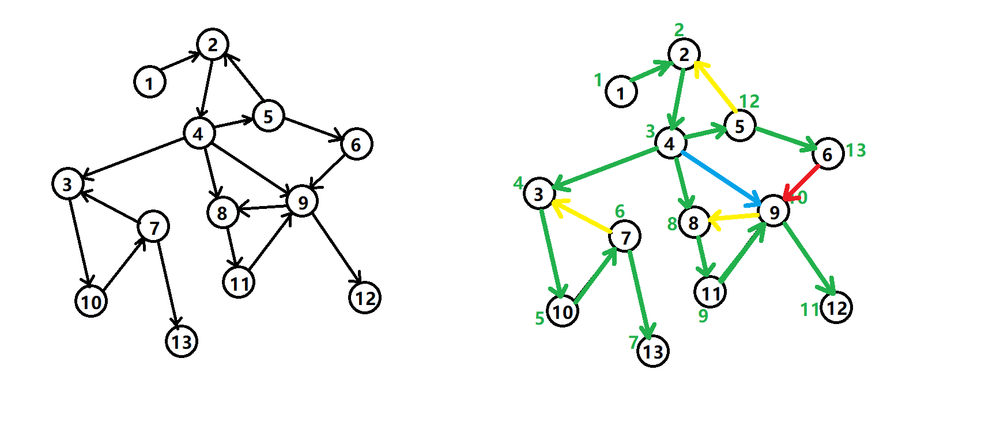
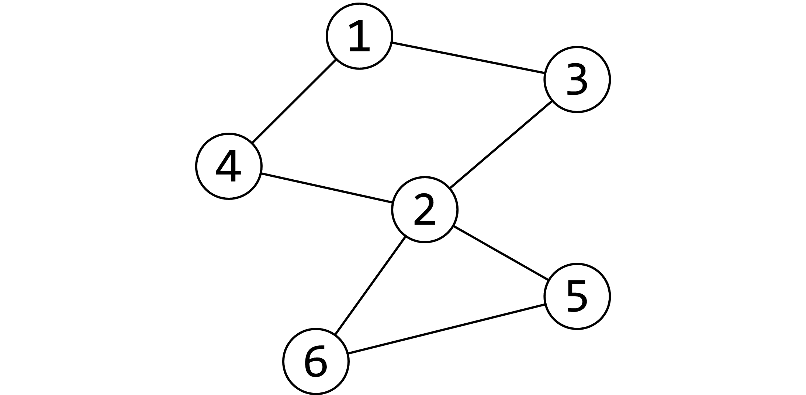
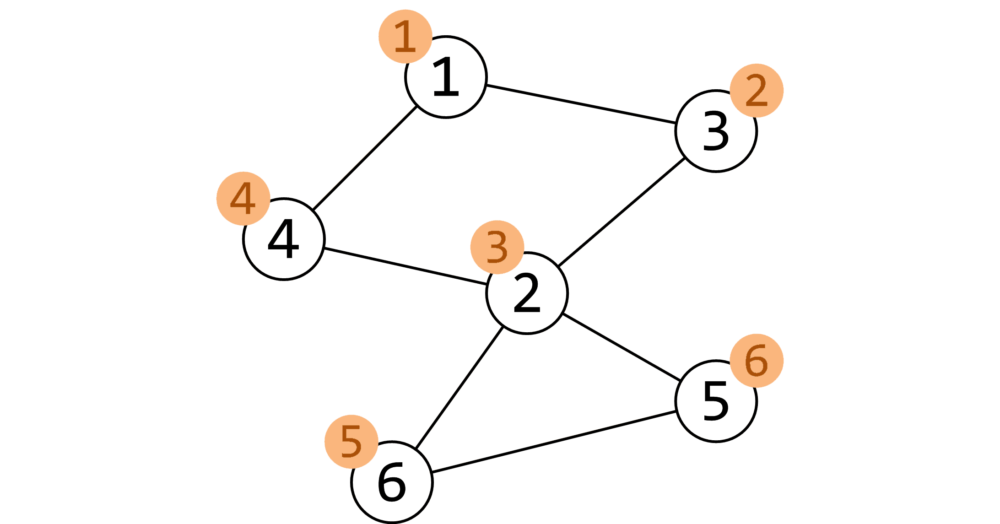
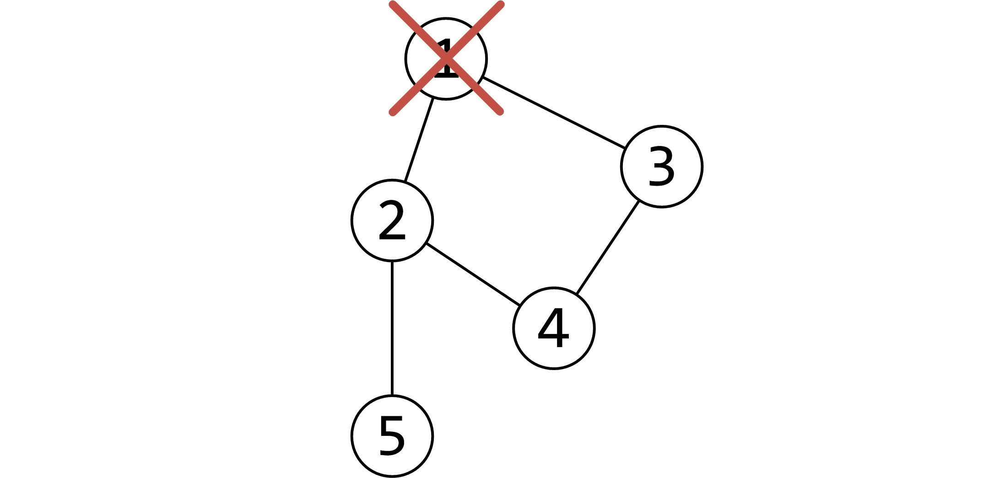

# 强连通分量

强连通的定义是：有向图 G 强连通是指，G 中任意两个结点连通。

在一个有向图G里，设两个点 a b 发现，由a有一条路可以走到b，由b又有一条路可以走到a，我们就叫这两个顶点（a，b）强连通。

强连通分量（Strongly Connected Components，SCC）的定义是：极大的强连通子图。

## Tarjan 算法

### DFS生成树



有向图的 DFS 生成树主要有 4 种边（不一定全部出现）：

1. 树边（tree edge）：绿色边，每次搜索找到一个还没有访问过的结点的时候就形成了一条树边。
2. 反祖边（back edge）：黄色边，也被叫做回边，即指向祖先结点的边。
3. 横叉边（cross edge）：红色边，它主要是在搜索的时候遇到了一个已经访问过的结点，但是这个结点 **并不是** 当前结点的祖先时形成的。
4. 前向边（forward edge）：蓝色边，它是在搜索的时候遇到子树中的结点的时候形成的。

我们考虑 DFS 生成树与强连通分量之间的关系。

如果结点 $u$ 是某个强连通分量在搜索树中遇到的第一个结点，那么这个强连通分量的其余结点肯定是在搜索树中以 $u$ 为根的子树中。 $u$ 被称为这个强连通分量的根。

## Tarjan算法求强连通分量

在 Tarjan 算法中为每个结点 $u$ 维护了以下几个变量：

1. $dfn[u]$ ：深度优先搜索遍历时结点 $u$ 被搜索的次序。
2. $low[u]$ ：设以 $u$ 为根的子树为 $Subtree(u)$ 。 $low[u]$ 定义为以下结点的 $dfn$ 的最小值： $Subtree(u)$ 中的结点；从 $Subtree(u)$ 通过一条不在搜索树上的边能到达的结点。

一个结点的子树内结点的 dfn 都大于该结点的 dfn。

从根开始的一条路径上的 dfn 严格递增，low 严格非降。

按照深度优先搜索算法搜索的次序对图中所有的结点进行搜索。在搜索过程中，对于结点 $u$ 和与其相邻的结点 $v$ （v 不是 u 的父节点）考虑 3 种情况：

1. $v$ 未被访问：继续对 $v$ 进行深度搜索。在回溯过程中，用 $low[v]$ 更新 $low[u]$ 。因为存在从 $u$ 到 $v$ 的直接路径，所以 $v$ 能够回溯到的已经在栈中的结点， $u$ 也一定能够回溯到。
2. $v$ 被访问过，已经在栈中：即已经被访问过，根据 $low$ 值的定义（能够回溯到的最早的已经在栈中的结点），则用 $dfn[v]$ 更新 $low[u]$ 。
3. $v$ 被访问过，已不在在栈中：说明 $v$ 已搜索完毕，其所在连通分量已被处理，所以不用对其做操作。

将上述算法写成伪代码：

```
TARJAN_SEARCH(int u)
    vis[u]=true
    low[u]=dfn[u]=++dfncnt
    push u to the stack
    for each (u,v) then do
        if v hasn't been search then
            TARJAN_SEARCH(v) // 搜索
            low[u]=min(low[u],low[v])// 回溯
        else if v has been in the stack then
            low[u]=min(low[u],dfn[v])
```


对于一个连通分量图，我们很容易想到，在该连通图中有且仅有一个 $dfn[u]=low[u]$ 。该结点一定是在深度遍历的过程中，该连通分量中第一个被访问过的结点，因为它的 DFN 值和 LOW 值最小，不会被该连通分量中的其他结点所影响。

因此，在回溯的过程中，判定 $dfn[u]=low[u]$ 的条件是否成立，如果成立，则栈中从 $u$ 后面的结点构成一个 SCC。

### 实现

```c++
int dfn[N], low[N], dfncnt, s[N], tp;
int scc[N], sc;  // 结点 i 所在 scc 的编号
int sz[N];       // 强连通 i 的大小
void tarjan(int u) {
  low[u] = dfn[u] = ++dfncnt, s[++tp] = u;
  for (int i = h[u]; i; i = e[i].nex) {
    const int &v = e[i].t;
    if (!dfn[v])
      tarjan(v), low[u] = min(low[u], low[v]);
    else if (!scc[v])
      low[u] = min(low[u], dfn[v]);
  }
  if (dfn[u] == low[u]) {
    ++sc;
    while (s[tp] != u) scc[s[tp]] = sc, sz[sc]++, --tp;
    scc[s[tp]] = sc, sz[sc]++, --tp;
  }
}
```

时间复杂度 $O(n + m)$ 。

**P2921 [USACO08DEC]在农场万圣节Trick or Treat on the Farm**

```c++
#include<bits/stdc++.h>
using namespace std;
const int maxn = 1e5+5;
int n;
int nxt[maxn];
int dfn[maxn];
int low[maxn];
bool ins[maxn];//是否在栈中
stack<int> s;
int colorcnt;//记录强连通分量个数
int timing;
int color[maxn];//第i点属于哪个强连通分量
int colornum[maxn];
int ans[maxn];
void tarjan(int u){
    timing++;
    dfn[u]=low[u]=timing;
    s.push(u);
    ins[u]=true;
    int v=nxt[u];//找子节点，子节点没有被访问过，则tarjan
    if(dfn[v]==0){
        tarjan(v);
        low[u]=min(low[u],low[v]);
    }
    else if(ins[v]==true){
        low[u]=min(low[u],low[v]);
    }
    if(dfn[u]==low[u]){//找到了一个强连通分量
        colorcnt++;
        while(s.top()!=u){
            int temp=s.top();
            s.pop();
            ins[temp]=false;
            color[temp]=colorcnt;
            colornum[colorcnt]++;
        }
        s.pop();
        color[u]=colorcnt;
        colornum[colorcnt]++;
        ins[u]= false;
    }
}
int findans(int u){
    if(nxt[u]==u){//闭环
        return ans[u]=1;
    }
    if(ans[nxt[u]]){//u的子节点有答案
        return ans[u]=ans[nxt[u]]+1;
    }
    else{
        return  ans[u]=findans(nxt[u])+1;
    }
}
int main(){
    cin >> n;
    for(int i = 1; i <= n;i++)
        cin >> nxt[i];
    for(int i=1;i<=n;i++){
        if(dfn[i]==0)
            tarjan(i);
    }
    for(int i=1;i<=n;i++){
        if(colornum[color[i]]>1){
            ans[i]=colornum[color[i]];
        }
    }
    for(int i=1;i<=n;i++){
        if(ans[i]==0){
            findans(i);
        }
    }
    for(int i=1;i<=n;i++){
        cout<<ans[i]<<endl;
    }
    return 0;
}
```


# 割点与桥

## 割点

对于一个**无向图**，如果把一个点删除后这个图的极大连通分量数增加了，那么这个点就是这个图的割点（又称割顶）。

## Tarjan


割点是 2，而且这个图仅有这一个割点。

按照 DFS 序给他打上时间戳（访问的顺序）。用dfn数组保存。


还需要另外一个数组 `low` ，用它来存储不经过其父亲能到达的最小的时间戳。

例如 `low[2]` 的话是 1， `low[5]` 和 `low[6]` 是 3。

然后我们开始 DFS，我们判断某个点是否是割点的根据是：

- 对于某个顶点 $u$ ，如果存在至少一个顶点 $v$ （ $u$ 的儿子），使得 $low_v>=dfn_u$ ，即不能回到祖先，那么 $u$ 点为割点。

- 另外，如果搜到了自己（在环中），如果他有两个及以上的儿子，那么他一定是割点了，如果只有一个儿子，那么把它删掉，不会有任何的影响。比如下面这个图，此处形成了一个环，从树上来讲它有 2 个儿子：


我们在访问 1 的儿子时候，假设先 DFS 到了 2，然后标记用过，然后递归往下，来到了 4，4 又来到了 3，当递归回溯的时候，会发现 3 已经被访问过了，所以不是割点。

更新 `low` 的伪代码如下：

```c++
如果 v 是 u 的儿子 low[u] = min(low[u], low[v]);
否则
low[u] = min(low[u], dfn[v]);
```

**P3388 【模板】割点（割顶）**

```c++
#include <bits/stdc++.h>
using namespace std;
const int maxn=2e6+5;
vector<int> G[maxn];//邻接矩阵
int dfn[maxn],low[maxn];
set<int> ans;
int timing;
void tarjan(int u,int rt){
    timing ++;
    low[u]=dfn[u]=timing;
    int child=0;
    for(int i=0;i<G[u].size();i++){//对普通结点
        int v=G[u][i];
        if(dfn[v]==0){//如果子节点没有被访问过，则访问子节点
            child++;
            tarjan(v,rt);
            low[u]=min(low[u],low[v]);
            if(u!=rt&&low[v]>=dfn[u]){
                ans.insert(u);
            }
        }
        low[u]=min(low[u],dfn[v]);//!!!无向图与有向图的区别
    }
    if(child>=2&&u==rt){//子节点>=2
        ans.insert(u);
    }
}
int main(){
    int n,m;
    int x,y;
    cin>>n>>m;
    for(int i=1;i<=m;i++){
        cin>>x>>y;
        G[x].push_back(y);
        G[y].push_back(x);
    }
    for(int i=1;i<=n;i++){
        if(dfn[i]==0)
            tarjan(i,i);
    }
    cout<<ans.size()<<endl;
    set<int>::iterator it;
    for(it=ans.begin ();it!=ans.end ();it++){
        cout<<*it<<" ";
    }
    cout<<endl;
}
```

## 桥

又叫割边或割桥

对于一个无向图，如果删掉一条边后图中的连通分量数增加了，则称这条边为桥或者割边。

### 实现

和割点差不多，只要改一处： $low_v>dfn_u$ 就可以了，而且不需要考虑根节点的问题。

割边和是不是根节点没关系的，原来我们求割点的时候是指点 $v$ 是不可能不经过父节点 $u$ 为回到祖先节点（包括父节点），所以顶点 $u$ 是割点。如果 $low_v=dfn_u$ 表示还可以回到父节点，如果顶点 $v$ 不能回到祖先也没有另外一条回到父亲的路，那么 $u-v$ 这条边就是割边。

# 2-SAT

SAT 是适定性（Satisfiability）问题的简称。一般形式为 k - 适定性问题，简称 k-SAT。而当 $k>2$ 时该问题为 NP 完全的。所以我们只研究 $k=2$ 的情况。

## 定义

2-SAT，简单的说就是给出 $n$ 个集合，每个集合有两个元素，已知若干个 $<a,b>$ ，表示 $a$ 与 $b$ 矛盾（其中 $a$ 与 $b$ 属于不同的集合）。然后从每个集合选择一个元素，判断能否一共选 $n$ 个两两不矛盾的元素。显然可能有多种选择方案，一般题中只需要求出一种即可。

## 现实意义

比如邀请人来吃喜酒，夫妻二人必须去一个，然而某些人之间有矛盾（比如 A 先生与 B 女士有矛盾，C 女士不想和 D 先生在一起），那么我们要确定能否避免来人之间没有矛盾，有时需要方案。这是一类生活中常见的问题。

使用布尔方程表示上述问题。设 $a$ 表示 A 先生去参加，那么 B 女士就不能参加（ $\neg a$ )； $b$ 表示 C 女士参加，那么 $\neg b$ 也一定成立（D 先生不参加）。总结一下，即 $(a \vee b)$ （变量 $a, b$ 至少满足一个）。对这些变量关系建有向图，则有： $\neg a\Rightarrow b\wedge\neg b\Rightarrow a$ （ $a$ 不成立则 $b$ 一定成立；同理， $b$ 不成立则 $a$ 一定成立）。建图之后，我们就可以使用缩点算法来求解 2-SAT 问题了。

算法考究在建图这点，我们举个例子来讲：

假设有 ${a1,a2}$ 和 ${b1,b2}$ 两对，已知 $a1$ 和 $b2$ 间有矛盾，于是为了方案自洽，由于两者中必须选一个，所以我们就要拉两条条有向边 $(a1,b1)$ 和 $(b2,a2)$ 表示选了 $a1$ 则必须选 $b1$ ，选了 $b2$ 则必须选 $a2$ 才能够自洽。

然后通过这样子建边我们跑一遍 Tarjan SCC 判断是否有一个集合中的两个元素在同一个 SCC 中，若有则输出不可能，否则输出方案。构造方案只需要把几个不矛盾的 SCC 拼起来就好了。

输出方案时可以通过变量在图中的拓扑序确定该变量的取值。如果变量 $\neg x$ 的拓扑序在 $x$ 之后，那么取 $x$ 值为真。应用到 Tarjan 算法的缩点，即 $x$ 所在 SCC 编号在 $\neg x$ 之前时，取 $x$ 为真。因为 Tarjan 算法求强连通分量时使用了栈，所以 Tarjan 求得的 SCC 编号相当于反拓扑序。

显然地，时间复杂度为 $O(n+m)$ 。

## 爆搜

就是沿着图上一条路径，如果一个点被选择了，那么这条路径以后的点都将被选择，那么，出现不可行的情况就是，存在一个集合中两者都被选择了。

那么，我们只需要枚举一下就可以了，数据不大，答案总是可以出来的。

#### 爆搜模板

```c++
struct Twosat {
  int n;
  vector<int> g[maxn * 2];
  bool mark[maxn * 2];
  int s[maxn * 2], c;
  bool dfs(int x) {
    if (mark[x ^ 1]) return false;
    if (mark[x]) return true;
    mark[x] = true;
    s[c++] = x;
    for (int i = 0; i < (int)g[x].size(); i++)
      if (!dfs(g[x][i])) return false;
    return true;
  }
  void init(int n) {
    this->n = n;
    for (int i = 0; i < n * 2; i++) g[i].clear();
    memset(mark, 0, sizeof(mark));
  }
  void add_clause(int x, int y) {  // 这个函数随题意变化
    g[x].push_back(y ^ 1);         // 选了 x 就必须选 y^1
    g[y].push_back(x ^ 1);
  }
  bool solve() {
    for (int i = 0; i < n * 2; i += 2)
      if (!mark[i] && !mark[i + 1]) {
        c = 0;
        if (!dfs(i)) {
          while (c > 0) mark[s[--c]] = false;
          if (!dfs(i + 1)) return false;
        }
      }
    return true;
  }
};
```

### **HDU3062 [Party](http://acm.hdu.edu.cn/showproblem.php?pid=3062) **

题面：有 n 对夫妻被邀请参加一个聚会，因为场地的问题，每对夫妻中只有 $1$ 人可以列席。在 $2n$ 个人中，某些人之间有着很大的矛盾（当然夫妻之间是没有矛盾的），有矛盾的 $2$ 个人是不会同时出现在聚会上的。有没有可能会有 $n$ 个人同时列席？

这是一道多校题，裸的 2-SAT 判断是否有方案，按照我们上面的分析，如果 $a1$ 中的丈夫和 $a2$ 中的妻子不合，我们就把 $a1$ 中的丈夫和 $a2$ 中的丈夫连边，把 $a2$ 中的妻子和 $a1$ 中的妻子连边，然后缩点染色判断即可。

```c++
#include <bits/stdc++.h>
using namespace std;
const int maxn=1005,maxm=2e5+5;

int n,m,a1,a2,c1,c2;
vector<int> G[maxn*2];
int timing=0,dfn[maxn*2],low[maxn*2],colorcnt=0,color[maxn*2];
stack<int> s;
bool ins[maxn*2];
void init(){
    timing=0;colorcnt=0;
    memset(dfn,0, sizeof(dfn));
    memset(low,0, sizeof(low));
    memset(color,0,sizeof(color));
    memset(ins,false,sizeof(ins));
    for(int i=0;i<2*n;i++)
        G[i].clear();

}
void tarjan(int u){
    timing++;
    dfn[u]=low[u]=timing;
    s.push(u);
    ins[u]=true;
    for(int i=0;i<G[u].size();i++){
        int v=G[u][i];
        if(dfn[v]==0){
            tarjan(v);
            low[u]=min(low[u],low[v]);
        }
        else if(ins[v]==true){
            low[u]=min(low[u],dfn[v]);
        }
    }
    if(dfn[u]==low[u]){
        colorcnt++;
        while(s.top()!=u){
            int temp=s.top();
            s.pop();
            ins[temp]=false;
            color[temp]=colorcnt;
        }
        s.pop();
        color[u]=colorcnt;
        ins[u]=false;
    }
}
bool solve(){
    for(int i=0;i<2*n;i++)
        if(dfn[i]==0)
            tarjan(i);

    for(int i=0;i<2*n;i+=2)
        if(color[i]==color[i+1])
            return 0;

    return 1;
}

int main(){
    while(~scanf("%d%d",&n,&m)){
        init();
        for(int i=1;i<=m;i++){
            scanf("%d%d%d%d",&a1,&a2,&c1,&c2);
//        cin>>a1>>a2>>c1>>c2;
            G[2*a1+c1].push_back(2*a2+1-c2);
//        G[2*a2+1-c2].push_back(2*a1+c1);
            G[2*a2+c2].push_back(2*a1+1-c1);
//        G[2*a1+1-c1].push_back(2*a2+c2);
        }
        if(solve()==true)
            printf("YES\n");
        else
            printf("NO\n");
    }


}
```

