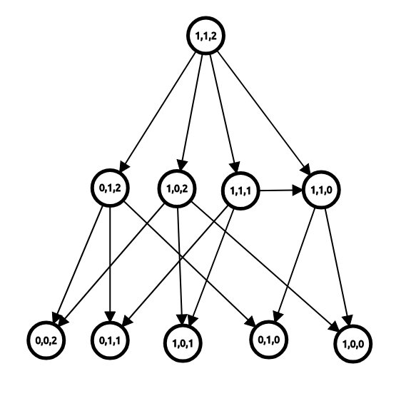

# 博弈论

**博弈论** ，是经济学的一个分支，主要研究具有竞争或对抗性质的对象，在一定规则下产生的各种行为。博弈论考虑游戏中的个体的预测行为和实际行为，并研究它们的优化策略。

通俗地讲，博弈论主要研究的是：在一个游戏中，进行游戏的多位玩家的策略。

## 公平组合游戏

公平组合游戏的定义如下：

- 游戏有两个人参与，二者轮流做出决策，双方均知道游戏的完整信息；
- 任意一个游戏者在某一确定状态可以作出的决策集合只与当前的状态有关，而与游戏者无关；
- 游戏中的同一个状态不可能多次抵达，游戏以玩家无法行动为结束，且游戏一定会在有限步后以非平局结束。

大部分的棋类游戏都 **不是** 公平组合游戏，如国际象棋、中国象棋、围棋、五子棋等（因为双方都不能使用对方的棋子）。

# 巴什博弈

 A和B一块报数，每人每次报最少1个，最多报4个，看谁先报到30。

其实如果知道原理，这游戏一点运气成分都没有，只和先手后手有关，比如第一次报数，A报k个数，那么B报5-k个数，那么B报数之后问题就变为，A和B一块报数，看谁先报到25了，进而变为20,15,10,5，当到5的时候，不管A怎么报数，最后一个数肯定是B报的，可以看出，作为后手的B在个游戏中是不会输的。

那么如果我们要报n个数，每次最少报一个，最多报m个，我们可以找到这么一个整数k和r，使n=k*（m+1）+r，代入上面的例子我们就可以知道，如果r=0，那么先手必败；否则，先手必胜。

**巴什博奕：只有一堆n个物品，两个人轮流从中取物，规定每次最少取一个，最多取m个，最后取光者为胜。**

```c++
#include <iostream>
using namespace std;
int main()
{
    int n,m;
    while(cin>>n>>m)
      if(n%(m+1)==0)  cout<<"后手必胜"<<endl;
      else cout<<"先手必胜"<<endl;
    return 0;
}
 
```

**HDU4764**

题目大意：Tang和Jiang轮流写数字，Tang先写，每次写的数x满足1<=x<=k，Jiang每次写的数y满足1<=y-x<=k，谁先写到不小于n的数算输。

结论：r=（n-1）%（k+1），r=0时Jiang胜，否则Tang胜。

```c++
#include <iostream>
#include <cstring>
#include <cstdio>
using namespace std;
int main(){
    int n,k;
    while (cin>>n>>k&&n+k)
    {
        n=n-1;//最大去到n-1,先取到n-1的一定是获胜方
        k=k+1;
        n=n%k;
        if (n!=0)
            cout<<"Tang"<<endl;
        else
            cout<<"Jiang"<<endl;
    }
}
```

#  **威佐夫博弈**

**有两堆各若干的物品，两人轮流从其中一堆取至少一件物品，至多不限，或从两堆中同时取相同件物品，规定最后取完者胜利。**

若两堆物品的初始值为（x，y），且x<y，则另z=y-x;

记w=（int）[（（sqrt（5）+1）/2）\*z ]；//黄金分割比

**若w=x，则先手必败，否则先手必胜。**

```c++
#include <cstdio>
#include <cmath>
#include <iostream>
using namespace std;
int main(){
    int n1,n2,temp;
    while(cin>>n1>>n2)
    {
        if(n1>n2)  
            swap(n1,n2);
        temp=floor((n2-n1)*(1+sqrt(5.0))/2.0);
        if(temp==n1) cout<<"后手必胜"<<endl;
        else cout<<"先手必胜"<<endl;
    }
    return 0;
}
```


## Nim游戏

$n$ 堆物品，每堆有 $a_i$ 个，两个玩家轮流取走任意一堆的任意个物品，但不能不取。

取走最后一个物品的人获胜。

例如，如果现在有 $n=3$ 堆物品，而每堆分别有 $2, 5, 4$ 个，那么可以取走第 $1$ 堆中的 $2$ 个物品，局面就变成了 $0, 5, 4$ ；或者也可以取走第 $2$ 堆的 $4$ 个物品，局面就变成了 $2, 1, 4$ 。

如果现在的局面为 $0, 0, 5$ ，甲取走了第 $3$ 堆的 $5$ 个物品，也就是取走了最后一个物品，此时甲获胜。

## 博弈图和状态

如果将每个状态视为一个节点，再从每个状态向它的后继状态连边，我们就可以得到一个博弈状态图。

例如，如果节点 $(i, j, k)$ 表示局面为 $i, j, k$ 时的状态，则我们可以画出下面的博弈图。



定义 **必胜状态** 为 **先手必胜的状态** ， **必败状态** 为 **先手必败的状态** 。

通过推理，我们可以得出下面三条定理：

- 定理 1：没有后继状态的状态是必败状态。
- 定理 2：一个状态是必胜状态当且仅当存在至少一个必败状态为它的后继状态。（**当前状态必胜：后继状态存在0**）
- 定理 3：一个状态是必败状态当且仅当它的所有后继状态均为必胜状态。（**当前状态必败：后继状态没有0**）

对于定理 1，如果游戏进行不下去了，那么这个玩家就输掉了游戏。

对于定理 2，如果该状态至少有一个后继状态为必败状态，那么玩家可以通过操作到该必败状态；此时对手的状态为必败状态——对手必定是失败的，而相反地，自己就获得了胜利。

对于定理 3，如果不存在一个后继状态为必败状态，那么无论如何，玩家只能操作到必胜状态；此时对手的状态为必胜状态——对手必定是胜利的，自己就输掉了游戏。

如果博弈图是一个有向无环图，则通过这三个定理，我们可以在绘出博弈图的情况下用 $O(N+M)$ 的时间（其中 $N$ 为状态种数， $M$ 为边数）得出每个状态是必胜状态还是必败状态。

## Nim和

桌子上有N堆石子$a_i$，游戏者轮流取石子。
每次只能从一堆中取出任意数目的石子，但不能不取。
取走最后一个石子者胜。

通过绘画博弈图，我们可以在 $O(\prod_{i=1}^n a_i)$ 的时间里求出该局面是否先手必赢。

但是，这样的时间复杂度实在太高。有没有什么巧妙而快速的方法呢？

定义 Nim 和 $=a_1 \oplus a_2 \oplus \ldots \oplus a_n$ 。

当且仅当 Nim 和为 $0$ 时，该状态为必败状态；否则该状态为必胜状态。

### 证明

为什么异或值会和状态的胜负有关？下面给出了这个定理的证明过程。

为了证明该定理，只需要证明下面三个定理：

- 定理 1：没有后继状态的状态是必败状态。
- 定理 2：对于 $a_1 \oplus a_2 \oplus \ldots \oplus a_n \neq 0$ 的局面，一定存在某种移动使得 $a_1 \oplus a_2 \oplus \ldots \oplus a_n = 0$ 。
- 定理 3：对于 $a_1 \oplus a_2 \oplus \ldots \oplus a_n = 0$ 的局面，一定不存在某种移动使得 $a_1 \oplus a_2 \oplus \ldots \oplus a_n = 0$ 。

对于定理 1，没有后继状态的状态只有一个，即全 $0$ 局面。此时 $a_1 \oplus a_2 \oplus \ldots \oplus a_n = 0$ 。

对于定理 2，不放假设 $a_1 \oplus a_2 \oplus \ldots a_n = k \neq 0$ 。如果我们要将 $a_i$ 改为 $a_i'$ ，则 $a_i'=a_i \oplus k$ 。

根据异或定义，一定有奇数个 $a_i$ 在 $k$ 在二进制下的最高位为 $1$ 。满足这个条件的 $a_i$ 一定也满足 $a_i > a_i \oplus k$ ，因而这也是个合法的移动。

对于定理 3，如果我们要将 $a_i$ 改为 $a_i'$ ，则根据异或运算律可以得出 $a_i=a_i'$ ，因而这不是个合法的移动。

## 有向图游戏与SG函数

有向图游戏是一个经典的博弈游戏——实际上，大部分的公平组合游戏都可以转换为有向图游戏。

在一个有向无环图中，只有一个起点，上面有一个棋子，两个玩家轮流沿着有向边推动棋子，不能走的玩家判负。

定义 $\operatorname{mex}$ 函数的值为不属于集合 $S$ 中的最小非负整数，即：

$$ \operatorname{mex}(S)=\min{x} \quad (x \notin S, x \in N) $$

例如 $\operatorname{mex}({0, 2, 4})=1$ ， $\operatorname{mex}({1, 2})=0$ 。

对于状态 $x$ 和它的所有 $k$ 个后继状态 $y_1, y_2, \ldots, y_k$ ，定义 $\operatorname{SG}$ 函数：

$$ \operatorname{SG}(x)=\operatorname{mex}{\operatorname{SG}(y_1), \operatorname{SG}(y_2), \ldots, \operatorname{SG}(y_k)} $$

而对于由 $n$ 个有向图游戏组成的组合游戏，设它们的起点分别为 $s_1, s_2, \ldots, s_n$ ，则有定理： **当且仅当 $\operatorname{SG}(s_1) \oplus \operatorname{SG}(s_2) \oplus \ldots \oplus \operatorname{SG}(s_n) \neq 0$ 时，这个游戏是先手必胜的。**

这一定理被称作 SG 定理。

## 将 Nim 游戏转换为有向图游戏

我们可以将一个有 $x$ 个物品的堆视为节点 $x$ ，则当且仅当 $y<x$ 时，节点 $x$ 可以到达 $y$ 。

那么，由 $n$ 个堆组成的 Nim 游戏，就可以视为 $n$ 个有向图游戏了。

根据上面的推论，可以得出 $\operatorname{SG}(x)=x$ 。再根据 SG 定理，就可以得出 Nim 和的结论了。


举个例子：

有n个物品，两个人，每次可以拿1个，2个，3个，不能拿者输掉比赛；假设n==8

画出SG图。


SG打表：

```c++
//f[]：可以取走的石子个数
//sg[]:0~n的SG函数值
//hash[]:mex{}
int f[N];//可以取走的石子个数
int sg[N];//0~n的SG函数值
int Hash[N];
int n;
void getSG(int n){
    memset(sg,0,sizeof(sg));
    for(int i = 1; i <= n; i++){
        memset(Hash,0,sizeof(Hash));
        for(int j = 1; f[j] <= i; j++)
            Hash[sg[i-f[j]]] = 1;
        for(int j = 0; j <= n; j++){    //求mes{}中未出现的最小的非负整数
            if(Hash[j] == 0){
                sg[i] = j;
                break;
            }
        }
    }
}
```

dfs：

```c++
//注意 S数组要按从小到大排序 SG函数要初始化为-1 对于每个集合只需初始化1遍
//n是集合s的大小 S[i]是定义的特殊取法规则的数组
int s[N],sg[N],n;
bool vis[N];
int dfs_SG(int x){
    if(sg[x] != -1)
        return sg[x];
    memset(vis,0,sizeof(vis));
    for(int i = 0; i < n; ++i){
        if(x >= s[i]){
            dfs_SG(x-s[i]);
            vis[sg[x-s[i]]] = 1;
        }
    }
    for(int i = 0;; ++i){
        if(!vis[i]){
            e = i;
            return sg[x] = i;
        }
    }
}
```

**HDU1847**

```c++
#include <bits/stdc++.h>
using namespace std;
const int N=1010;
//f[]：可以取走的石子个数
//sg[]:0~n的SG函数值
//hash[]:mex{}
int f[N],pos=1;//可以取走的石子个数
int sg[N];//0~n的SG函数值
int Hash[N];
int n;
void getSG(int n){
    memset(sg,0,sizeof(sg));
    for(int i = 1; i <= n; i++){
        memset(Hash,0,sizeof(Hash));
        for(int j = 1; f[j] <= i; j++)
            Hash[sg[i-f[j]]] = 1;
        for(int j = 0; j <= n; j++){    //求mes{}中未出现的最小的非负整数
            if(Hash[j] == 0){
                sg[i] = j;
                break;
            }
        }
    }
}
int main(){
    for(int i=1;i<2000;i*=2)
        f[pos++]=i;
    getSG(N);
    while(cin>>n){
        if(sg[n]==0){
            cout<<"Cici"<<endl;
        } else
            cout<<"Kiki"<<endl;
    }
}
```
**HDU1848**
```c++
#include <bits/stdc++.h>
using namespace std;
const int N = 1005;
int f[N];//可以取走的石子个数
int sg[N];//0~n的SG函数值
int Hash[N];

void getSG(int n){
    memset(sg,0,sizeof(sg));
    for(int i = 1; i <= n; i++){
        memset(Hash,0,sizeof(Hash));
        for(int j = 1; f[j] <= i; j++)
            Hash[sg[i-f[j]]] = 1;
        for(int j = 0; j <= n; j++){    //求mes{}中未出现的最小的非负整数
            if(Hash[j] == 0){
                sg[i] = j;
                break;
            }
        }
    }
}

int main(){
    f[0] = f[1] = 1;
    for(int i = 2; i <= 16; i++)
        f[i] = f[i-1]+f[i-2];
    getSG(1000);
    int m,n,p;
    while(scanf("%d%d%d",&m,&n,&p),m+n+p){
        if(sg[m]^sg[n]^sg[p])
            cout<<"Fibo"<<endl;
        else
            cout<<"Nacci"<<endl;
    }
}
```


# 矩阵乘法

**单位矩阵**

对于矩阵 $A$ ，主对角线是指 $A[i][i]$ 的元素。

一般用 $I$ 来表示单位矩阵，就是主对角线上为 1，其余位置为 0。


矩阵相乘只有在第一个矩阵的列数和第二个矩阵的行数相同时才有意义。

设 $A$ 为 $P \times M$ 的矩阵， $B$ 为 $M \times Q$ 的矩阵，设矩阵 $C$ 为矩阵 $A$ 与 $B$ 的乘积，

其中矩阵 $C$ 中的第 $i$ 行第 $j$ 列元素可以表示为：

$$ C_{i,j} = \sum_{k=1}^MA_{i,k}B_{k,j} $$

通俗的讲，在矩阵乘法中，结果 $C$ 矩阵的第 $i$ 行第 $j$ 列的数，就是由矩阵 $A$ 第 $i$ 行 $M$ 个数与矩阵 $B$ 第 $j$ 列 $M$ 个数分别相乘再相加得到的。

```c++
for(int k=1;k<=m;k++){
    for(int i=1;i<=n;i++){
        for(int j=1;j<=r;j++){
            C[i][j]+=A[i][k]*B[k][j];
        }
    }
}
```

矩阵乘法满足结合律，不满足一般的交换律。

利用结合律，矩阵乘法可以利用快速幂 的思想来优化。

对于整数的幂次，可以用快速幂

对于矩阵的幂次，也可以用快速幂

**P3390 【模板】矩阵快速幂**

```c++
#include <bits/stdc++.h>
using namespace std;
typedef long long LL;
const LL m=1e9+7;
LL n,k;
struct matrix{
    LL data[105][105];
};
matrix mul(matrix a,matrix b){
    matrix c;
    memset(c.data,0,sizeof(c.data));
    for(int i=1;i<=n;i++){
        for(int j=1;j<=n;j++){
            for(int k=1;k<=n;k++){
                c.data[i][j]=(c.data[i][j]+a.data[i][k]*b.data[k][j]%m)%m;
            }
        }
    }
    return c;
}
matrix quickpow(matrix a,LL k){
    matrix c;
    memset(c.data,0,sizeof(c.data));
    for(int i=1;i<=n;i++)
        c.data[i][i]=1;
    while(k){
        if(k&1)
            c=mul(c,a);
        k>>=1;
        a=mul(a,a);
    }
    return c;
}

int main(){
    scanf("%lld%lld", &n,&k);
    matrix a;
    for(int i=1;i<=n;i++)
        for(int j=1;j<=n;j++)
            scanf("%lld",&a.data[i][j]);
    matrix ans=quickpow(a,k);
    for(int i=1;i<=n;i++){
        for(int j=1;j<=n;j++){
            cout<<ans.data[i][j]<<" ";
        }cout<<endl;
    }

}
```

## 矩阵优化递推

**P1962 斐波那契数列**

平时我们可以使用线性递归的方式求解，但是如果$n=10^9$呢？

根据斐波那契数列的递推式 $F_n = F_{n-1} + F_{n-2}$ ，我们可以构建一个 $2\times 2$ 的矩阵来表示从 $F_i,F_{i+1}$ 到 $F_{i+1},F_{i+2}$ 的变换。于是在计算这个矩阵的 $n$ 次幂的时侯，我们使用快速幂的思想，可以在 $\Theta(\log n)$ 的时间内计算出结果。

斐波那契数列的递推可以用矩阵乘法的形式表达：

$$ \begin{bmatrix}F_{n-1} & F_{n} \cr\end{bmatrix} = \begin{bmatrix}F_{n-2} & F_{n-1} \cr\end{bmatrix} \cdot \begin{bmatrix}0 & 1 \cr 1 & 1 \cr\end{bmatrix} $$

设 $P = \begin{bmatrix}0 & 1 \cr 1 & 1 \cr\end{bmatrix}$ ，我们得到

$$ \begin{bmatrix}F_n & F_{n+1} \cr\end{bmatrix} = \begin{bmatrix}F_0 & F_1 \cr\end{bmatrix} \cdot P^n $$

于是我们可以用矩阵乘法在 $\Theta(\log n)$ 的时间内计算斐波那契数列。

```c++
#include <bits/stdc++.h>
using namespace std;
typedef long long LL;
const LL m=1e9+7;
LL n=2,k;
struct matrix{
    LL data[105][105];
};
matrix mul(matrix a,matrix b){
    matrix c;
    memset(c.data,0,sizeof(c.data));
    for(int i=1;i<=n;i++){
        for(int j=1;j<=n;j++){
            for(int k=1;k<=n;k++){
                c.data[i][j]=(c.data[i][j]+a.data[i][k]*b.data[k][j]%m)%m;
            }
        }
    }
    return c;
}
matrix quickpow(matrix a,LL k){
    matrix c;
    memset(c.data,0,sizeof(c.data));
    for(int i=1;i<=n;i++)
        c.data[i][i]=1;
    while(k){
        if(k&1)
            c=mul(c,a);
        k>>=1;
        a=mul(a,a);
    }
    return c;
}

int main(){
    scanf("%lld",&k);
    if(k<=2){
        cout<<1<<endl;
        return 0;
    }
    matrix a;
    a.data[1][1]=a.data[1][2]=a.data[2][1]=1;
    a.data[2][2]=0;
    matrix f;
    f.data[1][1]=f.data[2][1]=f.data[1][2]=f.data[2][2]=1;
    matrix ans=quickpow(a,k-2);
    ans=mul(ans,f);
    cout<<ans.data[1][1]<<endl;

}
```

如果$F_n = aF_{n-1} + bF_{n-2}+cF_{n-3}$呢？


如果$F_n = F_{n-1} + F_{n-2}$，但是求$Sum_n = F_{1} + F_{2}+……+F_{n}$


